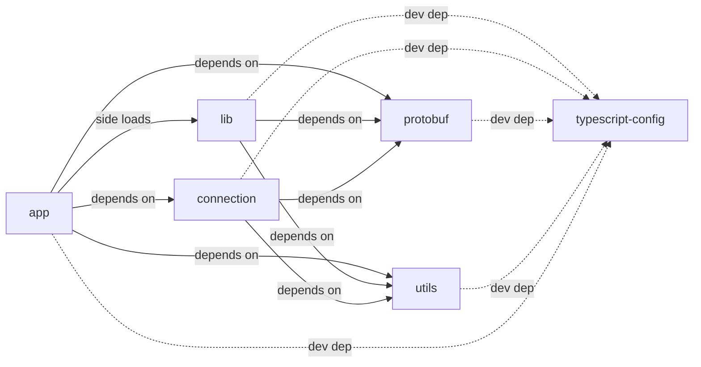

# Streamlit Frontend

## What is Streamlit Frontend?

Streamlit Frontend is a set of frontend packages tied to behaviors that make up a Streamlit App. Originally, Streamlit Frontend was a monolith, but we have since found unique ways to inject Streamlit behavior in multiple different products.

## Packages

The following are packages:

- **app** - The Streamlit app layout (used to bundle into Streamlit library)
- **connection** - Code to establish the Websocket connection
- **lib** - Right now, this is a catchall, but this is being refactored to be more focused. Namely, it supports a Streamlit "View" that contains elements, widgets, and layouts.
- **protobuf** - Our protobuf code in one library.
- **typescript-config** - configuration for typescript across all the packages.
- **utils** - some shared utils used across Streamlit

## Getting Started

- Run `yarn start` or `make frontend-dev` to start the development server.

## Dependency Diagram

The dependency diagram below describes the interaction between the packages in our workspace.

## License

Streamlit is completely free and open-source and licensed under the [Apache 2.0](https://www.apache.org/licenses/LICENSE-2.0) license.
